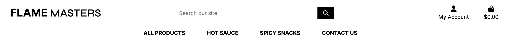

# Flame Masters

Link for the finished deployed site: https://flame-masters-f04a2ade371e.herokuapp.com/

# Table of Contents

- [Flame Masters](#flame-masters)
- [Table of Contents](#table-of-contents)
- [Site Goals](#site-goals)
- [Business Model](#business-model)
- [Database](#database)
- [Agile Methodology](#agile-methodology)
- [Design](#design)
- [Features](#features)
- [Technology Used](#technology-used)
- [Deployment \& Development](#deployment--development)
- [Testing](#testing)
- [Credits](#credits)
- [Acknowledgements](#acknowledgements)

# Site Goals
The goals of the site are to provide users with an attractive site providing a range of Hot Sauces and Spicy Snacks with varying levels of heat.
The user can decide how hot they want to go and view all products within that range.
If the user has a favourite brand, they can also view all products from that range.

# Business Model

## Business Overview:
The business operates as a B2C e-commerce platform, dedicated to providing a diverse range of fiery hot sauces and spicy snacks through an online store. It specializes in offering affordable yet flavorful products, catering to spice enthusiasts with pricing ranging from $1.95 to $17.95.
The business offers free shipping when the user makes a purchase over $30.

## Advantages for the Business Owner:

* Scalability: The business will be relatively easy to expand as the business grows, accomodating demand.
* Global Accessibility: The website offers worldwide delivery, allowing a wide reach of users.
* Cost Efficiency: Since there is no requirement for physical storefronts this reduces overall overhead
* Impulse Purchases: Affordable pricing encourages spontaneous purchases, enhancing sales potential. Free delivery marker encourages users to 'buy one more' to reach free delivery
* Niche Targeting: The website focuses on a specific market segment with a specific target audience in spicy food lovers.

### Challenges:

* Brand Establishment: Building brand recognition takes time and requires a robust marketing approach to stand out in the market.
* Trust Building: Establishing trust and loyalty without a physical presence may require offering discounts or special promotions.
* Marketing Investment: Generating organic traffic may be time-consuming, requiring active marketing efforts or investment in paid advertising.
* Order Volume Requirement: Processing a substantial number of orders is essential to maintain profitability due to lower price points.

## Site User
There are many potential users that would shop on this website

* Spice Enthusiasts: Individuals who enjoy bold and intense flavors, seeking out new and exciting spicy food experiences.
* Foodies: People passionate about exploring different cuisines and flavors, who are always on the lookout for unique and flavorful products to enhance their culinary adventures.
* Adventurous Eaters: Individuals who are passionate about pushing the limits of their taste and what levels of spice they can handle.
* Gift Shoppers: Customers looking for distinctive and memorable gifts for friends or family members who share a love for spicy food and want to purchase a more unusual gift for them
* Health-conscious Consumers: Those who appreciate the health benefits associated with spicy foods, such as metabolism boosting properties or potential pain relief, and seek out quality products that align with their dietary preferences. Since most hot sauces are naturally vegan, it is also an attractive business for users that are conscious of eating animal products.

## Marketing Strategy
The businesses marketing strategy going forward is:

* Use the Facebook business page, seen in then SEO section of this README to promote the business.
* Send out offers via the MailChimp newsletter and offer special subscriber access to new products before they are fully launched
* Use paid advertisement such as Google Ads to bring the promoted link on google searches. Potentially use sponsored Facebook ads to promote a wider reach of users.
* The business may also benefit from partnering with influencers, the size of which depends on the size of the business to coincide with demand.

# SEO

[Wordtracker](https://www.wordtracker.com/search?query=hot%20sauce) was used to help generate keywords on the site.
Description and meta tags were used to help the SEO. Although Google does not use meta keywords for searches anymore these were added for the short tail keywords for consistency.

## Keywords

* Short tail keywords: hot sauce, spicy snacks, spicy food, chili sauce, spicy noodles, spicy nuts, habanero, jalapeno, ghost pepper, spicy condiments, worldwide, delivery, affordable hot sauces, hot ones hot sauce, da bomb hot sauce
* Long tail keywords: Flame Masters online store for hot sauce and spicy snacks with worldwide delivery

## Sitemap.xml
A sitemap was generated via https://www.mysitemapgenerator.com/ so that search engines like Google can search it effectively

### Robots.txt
I generated a robots.txt file so that google can crawl the site effectively.
The accounts and cart pages were blocked off from User Agent crawling to prevent these pages from being indexed as these wouldn't be necessary to find on a search engine result

### Facebook Business Page

[Facebook](https://www.facebook.com/profile.php?id=61556519101346) was used to generate the Facebook page.
The cover photo uses the same image as the homepage on the site for consistency.
The profile picture was generated using the ChatGPT image generator.

In case this is deactivated, these screenshots are also available:

### Favicon

The favicon for the site was generated using this website:
https://favicon.io/
I used the simple text to ico option, and added it as FM for the initials of the website.

# Database
Database scheme diagram:

# Agile Methodology
This project was developed using agile methodologies by utilising Epics and User stories.
User storied were assigned to Epics. 
The Epics & User Stories were prioritised by labels. `must have`, `should have`, `could have`.
A kanban board in GitHub was used to track these, with a `not started`, `in progress`, `done`, `NINTH(not important, nice to have)` and `bug` sections.
When a user story is completed, it gets moved to the done section.
The full kanban board can be viewed here: LINK

## Labels
The labels are priorised as follows:

|             |                                                                                      |
|-------------|--------------------------------------------------------------------------------------|
| must have   | This feature/issue is required for the project to function                           |
| should have | Important to implement but will not crash the project without but still key features |
| could have  | would like to have, but not essential to the project                                 |
| bug         | Something isn't working                                                              |

These result in the following stats:

## Epics
There are six Epics within this project:

**EPIC: Design & Experience**
This epic focuses on the overall styling of the website

**EPIC: User Interactivity & Feedback**
This epic focuses on the communications between the website and the user

**EPIC: Product Admin**
This epic focuses on the product management on the front end for the admin user

**EPIC: User Accounts**
This epic focuses on the user's ability to register for an account

**EPIC: Product Viewing**
This epic focuses on the features of viewing products on the front end for the shopping user

**EPIC: Cart & Payments**
This epic focuses on the shopping cart and payments

## User Stories
Majority of User stories are linked to Epics. Labels are applied for prioritisation, such as `must have`, `should have` and `could have`.

**Epic**|**User story**|**Label**
:-----:|:-----:|:-----:
-|As a Developer, I can deploy the website early so that I can avoid any technical issues or stress later in the project|Must have
 Design & Experience|As a User, I can view a clean and attractive website so that I can have a positive experience|could have
 Design & Experience|As a User, I can receive feedback messages so that I can gain feedback from the actions I have completed|could have
User Interactivity & Feedback|As a User, I can receive confirmation emails so that I can track my order|should have
User Interactivity & Feedback|As a User, I can contact the website admins so that I can resolve any issues with my order|could have
User Interactivity & Feedback|As a user, I can leave reviews on a product so that I can give my opinion on the product|could have
User Interactivity & Feedback|As a user, I can sign up for a newsletter so that I can keep up to date on news from my favourite store|could have
User Interactivity & Feedback|As a user, I can edit my product reviews so that I can update my feedback|should have
User Interactivity & Feedback|As a User, I can delete my reviews so that I can change my feedback|could have
Product Admin|Allow Admin users to create products|must have
Product Admin|As an Admin, I can update products on the front end so that I can update details on the products|must have
Product Admin|As an Admin, I can delete products on the front end so that I can manage my store|must have
User Accounts|As a user, I can register for an account so that I can manage my details|should have
User Accounts|As a user, I can view my order history on my profile so that I can track my purchasing|could have
User Accounts|As a user, I can update my personal details so that I can have them saved for my next purchase|should have
Product Viewing|As a user, I can view all available products so that I can compare and decide which I want to purchase|must have
Product Viewing|As a user I can view the detailed descriptions of a product so that I can decide if it is suitable for my taste|must have
Product Viewing|As a user I can see the price of the product so that I can know if its in my price range|must have
Product Viewing|As a user I can choose different categories from the front end so that I can find the products that I want to purchase|should have
Product Viewing|As a user, I can search for products so that I can find the product I am looking for|should have
Cart & Payments|As a user I can add products to my cart so that I can purchase them|must have
Cart & Payments|As a user I can remove items from my cart so that I can purchase something else|must have
Cart & Payments|As a user I can update the number of items in my cart so that I can easily purchase the correct number of items|must have
Cart & Payments|As a user I can see how much total order will cost so that I can know if I can afford my purchase|must have
Cart & Payments|As a user I can make payments so that I can receive my products|must have

## Wireframes

The following wireframes were used to plan the look of the site:

Home Page:

Products Page:

Cart Page:

# Design

## Color Scheme

The main color scheme is white, grey and black.
This overall gives a pleasant, clean look to the website

## Typography

Fonts were chosen from GoogleFonts

* [Syne](https://fonts.google.com/specimen/Syne) was used for header fonts
* [Inter](https://fonts.google.com/specimen/Inter) was used for all other fonts
* San-serif was used as the fallback font

## Imagery

Images were sourced from several places to get suitable images of a wide range of products.
The full details of sources are in the media credits section of this README

# Features 

## Current Features

### Navigation

The navbar is based on the Boutique Ado walkthrough. It is responsive via the bootstrap classes and features options like filtering products, contacting the website admins, viewing the shopping cart and signing up/logging in.

### Authentication

The authentication is located in the top header navbar section.
This allows users to register for an account, login and sign out.
This allows users to see different content based on their account role like user, or admin/superuser

### Products

The products page is based on the Boutique Ado walkthrough.
It is also responsive via the bootstrap classes and features counts of the products features.
It also allows sorting by brand name, heat level, price, etc.

#### Product Detail

The product detail allows the user to view the full details of the product.
The user can add the product to the cart from this page.
It also includes the average rating and ingredients.
If the website owner marks the product as a staff favourite it also notes this for the user on this page.

### Product Reviews

The product reviews can be found at the bottom of the product detail page.
This allows users to add review if they have ordered a product.
They can also only leave one review for a product, this helps prevent the data on the rating from getting skewed by multiple reviews from one person.
The user that made the review is allowed to edit or delete their review, allowing them to change their feedback.

### Cart & Checkout

The shopping cart uses bootstrap to remain responsive.
It also allows the user to increase or decrease the number of items in the cart via the buttons on the right.

The checkout also uses bootstrap to remain responsive.
It provides on order summary and allows the user to save the details added to the checkout to their profile if they are logged in.

### User Profile

The user profile allows the user to update their information that will be loaded into the checkout.
The user can also view their previous orders via the profile page.

### Contact

The contact page allows users to get into contact with the website owners. They can submit general queries, complaints and returns on this page.
This page also allows the user to sign up for the MailChimp newletter to keep up to date with the latest news.

### Contact Submissons

Superusers can view the contact submissions page, which shows the details of the contact form submissions.
This allows the superusers to view the contacts from their users and provides them with their email address so they can liase with them further.

### User permissions

The website allows front end CRUD operations for the superuser.
They can add, edit and delete products.
A user that leaves a review is also allowed to add, edit and delete product reviews for products they have purchased.
The restrictions added via the code ensures that there is a secure check placed on each crud operation to ensure only the correct user is allowed to complete these actions.

## Future Features

* Wishlist: It would be nice to have a wishlist to allow users to have more interations with the site. The wishlist is also great for the owners of the site as it allows them to show which products their users love and can then use that information to gear their marketing towards that further.
* Multiple payment options: This site currently uses stripe payments, it would be nice in future to add options to include applepay and google pay to allow for swifter checkouts.
* Live Chat Support: As the website grows, it would be great to include a live chat support for users to speak directly with a member of staff for any questions or concerns they may have.

## Accessibility

* Aria Labels were used on all buttons and links throughout the site to ensure accessibility needs are met
* On the initial completion of the code, I used lighthouse to look into accessibility of the site. There were several issues noted with the links and colors on the site. The links for CRUD functions like updating product quantity, editing product reviews etc were showing issues with color contrast. I updated these to buttons to ensure there was enough contrast for the user.

# Technology Used

## Languages

* HTML
* CSS
* Python
* JavaScript

## Frameworks, Libraries & Programs 

* BootStrap
* Django
* [ElephantSQL](https://www.elephantsql.com/) + PostgreSQL
* AWS S3
* CrispyForms
* django-allauth
* gunicorn
* psycopg2
* requests-oauthlib
* sqlparse
* urllib3
* FontAwesome

# Deployment & Development

## Forking the Repository

1. Log in or Sign up to [GitHub](https://github.com/)
2. Navigate to https://github.com/saziosu/book-swap.
3. Click the 'fork' button in the top right corner.
4. Feel free to customize your repo name, this is not required.
5. Click the Create Fork button.

## Deploy to Heroku
Heroku was used to deploy this site:

1. Run pip3 freeze > requirements.txt in the console to set up the requirements.txt file. This command will create the file if it does not already exist.
2. Commit any changes and push to GitHub.
3. Navigate to Heroku's website and log in to the dashboard.
4. Click on "Create new app" in the top right.
5. Enter the "App name" and select your region, then click "Create App". 
6. Head to the Settings tab in the new app.
7. Go to "Config Vars" under the Settings tab.
8. Click on "Reveals Config Vars".
9. Add the "AWS_ACCESS_KEY_ID", "AWS_SECRET_ACCESS_KEY", "EMAIL_HOST_PASS", "EMAIL_HOST_USER", "STRIPE_PUBLIC_KEY", "STRIPE_SECRET_KEY", "STRIPE_WH_SECRET", "DATABASE_URL", and "SECRET_KEY" values generated for the project. Set "USE_AWS" to True
10. Add "PORT" key and "8000" value to the config vars.
11. Move to the "deploy" tab on the app, and scroll down to the deployment method section.
12. Select "GitHub" and connect to GitHub.
13. Search for the appropriate GitHub repo and Connect.
14. Select "Automatic deploys" or "Manual deploys" to deploy the application.

# Testing

[TESTING.md](TESTING.md)

# Credits

## Code

* [Code Institute](https://github.com/Code-Institute-Solutions/boutique_ado_v1) I relied heavily on the Boutique Ado walkthrough with several areas of the site such as profiles, cart, home, products, templates, etc
* [Code With Stein](https://www.youtube.com/watch?v=8iCqlFyFu2s) this resource was helpful in planning the product reviews.
* [Django documentation](https://docs.djangoproject.com/en/5.0/topics/forms/modelforms/#django.forms.ModelForm) this resource was used to help with setting up the contact forms
* [StackOverflow](https://stackoverflow.com/questions/67351312/django-check-if-superuser-in-class-based-view) this resource was helpful in securing the contact views to ensure that only superusers can view the contact form submissions.
* [CrispyForms documentation](https://django-crispy-forms.readthedocs.io/en/latest/form_helper.html) used this resource to help use the crispyforms layout helper on my contact modelform
* [ChatGPT](https://chat.openai.com/) I used ChatGPT with help securing my add_product_review view to only users that have ordered the product before and only allowing the user to order it one time to help prevent the ratings being skewed by multiple reviews from a single user.
* [OpenClassrooms](https://openclassrooms.com/en/courses/6967196-create-a-web-application-with-django/7349788-delete-objects-safely-with-user-confirmation) this resource was helpful in setting up the view to delete product reviews. I also used it to refactor the delete_product view to provide a confirmation template that the user needs to confirm they want to delete the selected item.
* [Django Documentation](https://docs.djangoproject.com/en/5.0/ref/class-based-views/generic-editing/#django.views.generic.edit.CreateView) this documentation was helpful with setting up the contact form views.
* [Django Documentation](https://docs.djangoproject.com/en/5.0/topics/auth/default/) this was helpful in settings up the contact form submissions view to allow only the superuser to view the contact form submissions from the users.

## Media
Product images were gained from these sources:

* [Favicon](https://favicon.io/) I used this website to generate my favicon
* [ChiliChump](https://chillichump.com/wp-content/uploads/2023/09/Hot-sauce-ingredients.png)
* [Hot Ones](https://heatonist.com/products/hot-ones-hot-sauce-los-calientes-rojo)
* [Tobasco](https://www.ebay.co.uk/itm/123993107394?var=426101877330)
* [Tia Lupita](https://tialupitafoods.com/collections/all-products/products/habanero-hot-sauce)
* [Zing](https://www.texasfood.com/Mikey-Vs-Zing-Mild-Sauce.html)
* [Beyond Insanity](https://world.openfoodfacts.org/product/0732458901140/bottle-da-bomb-beyond-insanity-hot-sauce)
* [Dillicous](https://chillicult.co.uk/angry-irishman-dill-licious-dill-pickle-hot-sauce)
* [Ghost Pepper Jolokia](https://davesgourmet.com/products/ghost-pepper-jolokia-sauce/)
* [Blue Diamond](https://bluediamondstore.com/products/bold-spicy-dill-almonds-6oz-cans-case-of-12)
* [Teriyaki Takis](https://www.candyland.ie/products/takis-ninja-teriyaki)
* [Blackberry Chipotle](https://www.hotsauceemporium.co.uk/product/hot-headz-blackberry-chipotle/)
* [KP Chili peanuts](https://www.tesco.com/groceries/en-GB/products/297814101)
* [Wasabi Peas](https://www.asiamarket.ie/khao-shong-wasabi-coated-green-peas-280g.html)
* [Kolohekid](https://adoboloco.com/shop/kolohekid-ghost-pepper-hawaiian-hotsauce/)
* [Hot Habenero Sauce](https://www.hotsauceemporium.co.uk/product/marie-sharps-hot-habanero/)
* [Da Bomb](https://world.openfoodfacts.org/product/0732458901140/bottle-da-bomb-beyond-insanity-hot-sauce)
* [Bajan Pepper](https://www.hotsauceemporium.co.uk/product/daddy-cools-bajan-pepper-sauce/)
* [Samyang Carbo](https://www.asiamarket.ie/samyang-carbo-hot-chicken-flavor-ramen-130g.html)
* [Cheetos](https://www.walmart.com/ip/Cheetos-Crunchy-XXTRA-Flamin-Hot-Cheese-Flavored-Snack-Chips-8-5-oz-Bag/49909688)
* [Taki Fuego](https://sweetboutique.ie/products/takis-fuego-92-3g)
* [Ghost Pepper peanuts](https://spicesontheweb.co.uk/insane-ghost-pepper-peanuts-80g/)
* [Samyang 3x](https://www.asiamarket.ie/samyang-3xspicy-bulkdak-noodle-140g.html)
* [Jalapeno Apple](https://www.hotsauceemporium.co.uk/product/bravado-spice-co-jalapeno-green-apple/)
* [Funken Hot](https://www.hotsauceemporium.co.uk/product/karma-sauce-funken-hot/)
* [Ultimate Insanity](https://www.hotsauceemporium.co.uk/product/daves-gourmet-ultimate-insanity/)
* [Reapers Gummy Bear](https://chillibom.com.au/collections/5-plus-chillibom-heat-rating/products/rummy-bear-reapers-gummy-bears?variant=39348998570038)

## Content
I used the following resources to get product descriptions and ingredients
* 
* [Ultimate Insanity](https://davesgourmet.com/products/ultimate-insanity-sauce)
* [Ghost Pepper Jolokia](https://davesgourmet.com/products/ghost-pepper-jolokia-sauce)
* [Funken Hot](https://www.hotsauceemporium.co.uk/product/karma-sauce-funken-hot/)
* [BlackBerry Chipotle](https://hot-headz.com/sauces/hot-chilli-sauces/hot-headz-blackberry-chipotle-hot-sauce/)
* [Beyond Insanity](https://www.hotsauceemporium.co.uk/product/da-bomb-beyond-insanity/)
* [Hot Habenero Sauce](https://www.hotsauceemporium.co.uk/product/marie-sharps-hot-habanero/)
* [Bajan Pepper](https://www.hotsauceemporium.co.uk/product/daddy-cools-bajan-pepper-sauce/)
* [Kolohekid](https://adoboloco.com/shop/kolohekid-ghost-pepper-hawaiian-hotsauce/)
* [Tia Lupita](https://tialupitafoods.com/collections/all-products/products/habanero-hot-sauce)
* [Hot Ones](https://heatonist.com/products/hot-ones-hot-sauce-los-calientes-rojo)
* [Tobasco](https://shop.tabasco.com/products/original-red-sauce)
* [Zing](https://www.texasfood.com/Mikey-Vs-Zing-Mild-Sauce.html)
* [Jalapeno Apple](https://simply-texas-gourmet-foods.myshopify.com/products/bravado-jalapeno-apple-hot-sauce#product-info)
* [Dillicous](https://chillicult.co.uk/angry-irishman-dill-licious-dill-pickle-hot-sauce)
* [Blue Diamond](https://www.amazon.com/Blue-Diamond-Almonds-Spicy-Pickle/dp/B07XHRRRQ6?th=1)
* [Blue Diamond](https://bluediamondstore.com/products/bold-spicy-dill-almonds-6oz-cans-case-of-12)
* [Teriyaki Taki](https://mesadelsur.com/en/products/takis-ninja-teriyaki-90g)
* [KP Chili peanuts](https://www.tesco.com/groceries/en-GB/products/297814101)
* [Wasabi Peas](https://www.asiamarket.ie/khao-shong-wasabi-coated-green-peas-280g.html)
* [Samyang Carbo](https://www.asiamarket.ie/samyang-carbo-hot-chicken-flavor-ramen-130g.html)
* [Cheetos](https://www.cheetos.com/products/cheetos-crunchy-xxtra-flamin-hot-cheese-flavored-snacks)
* [Taki Fuego](https://takis.ca/products/spicy-tortilla-chips/takis-fuego/280-g)
* [Ghost Pepper peanuts](https://spicesontheweb.co.uk/insane-ghost-pepper-peanuts-80g/)
* [Samyang 3x](https://www.asiamarket.ie/samyang-3xspicy-bulkdak-noodle-140g.html)
* [Reapers Gummy Bear](https://chillibom.com.au/collections/5-plus-chillibom-heat-rating/products/rummy-bear-reapers-gummy-bears?variant=39348998570038)

# Acknowledgements

* Graeme, my mentor, for all the help and advice throughout the project.
* Course Facilitator Alan for all the helpful tips and tricks, and great guidance throughout the project.
* My cohort classmates for feedback during our standups.

[Top](#flame-masters)