# Flame Masters | Testing

Link for the finished deployed site: [FlameMasters](https://flame-masters-f04a2ade371e.herokuapp.com/)

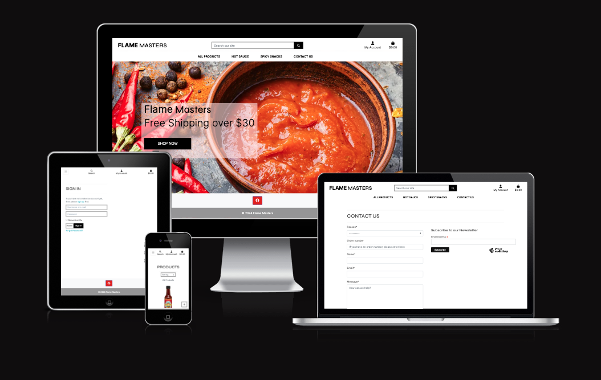

# Table of Contents

- [Flame Masters | Testing](#flame-masters--testing)
- [Table of Contents](#table-of-contents)
- [Testing Tools](#testing-tools)
  - [W3C Validator](#w3c-validator)
  - [CSS Validator](#css-validator)
    - [JavaScript Validator](#javascript-validator)
    - [Python Validator](#python-validator)
    - [Lighthouse Report](#lighthouse-report)
- [Manual Testing](#manual-testing)
- [Bugs](#bugs)
  - [Known Bugs](#known-bugs)
  - [Fixed bugs](#fixed-bugs)

# Testing Tools

## W3C Validator

[W3C](https://validator.w3.org/) was used to validate the HTML code across all pages of the website.
Due to the django templating, pasting directly from the code was not possible.
Instead the source code via the browser was used to test these and directly input into the validator.
Several changes were made to resolve any errors found

## CSS Validator

[Jigsaw](https://jigsaw.w3.org/css-validator/) was used to validate the CSS code across all possible pages of the website.

| Page     | Pass/Fail |
| -------- | --------- |
| Homepage | Pass      |
| Products | Pass      |
| Contact  | Pass      |
| Login    | Pass      |
| Cart     | Pass      |

All other pages required login which was not handled by the validator via the url
Most of the pages are utilising Bootstrap for styling, however the custom css from style.css was input manually and passed with no errors:

**base.css**
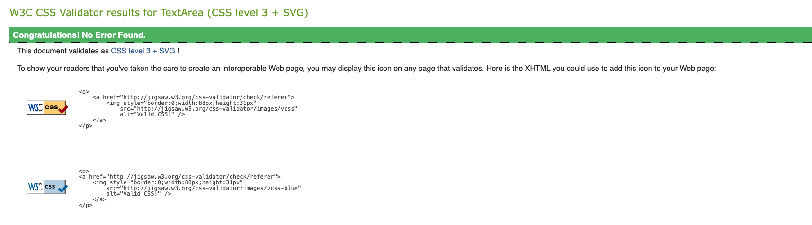

**checkout.css**
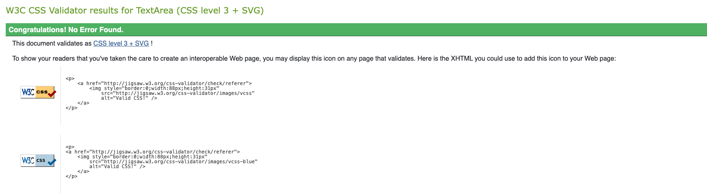

**profile.css**
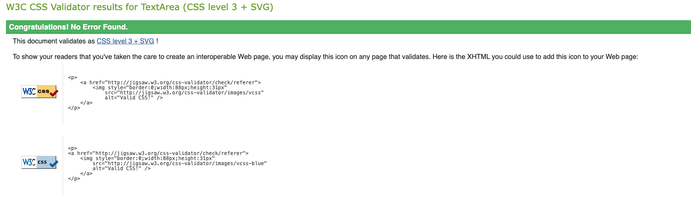

### JavaScript Validator

[JShint](https://jshint.com/) was used to validate the JavaScript on the site.

Javascript from the following templates/files were tested:
* cart.html
* stripe_elements.js
* products.html
* quantity_input_script.html
* countryfield.js

All passed through the validators.
Most showed errors for undefined variables or unused variables, but these are coming from the HTML that is not seen by the validator

### Python Validator

The [Code Institute Python Linter](https://pep8ci.herokuapp.com/) was used to validate the python code written on the project
Several edits were made to resolve any errors, which were mainly lines too long and a missing new line at the end of the file.
One file needed the `# noqa` applied as the long line could not be resolved.
Whenever this was updated, to resolve style issues it lead to python syntax errors and it was decided to leave this as is for the moment.
Some files, such as migration files and manage.py were showing lines too long but these were not updated as they are native django files

| File                            | Pass/Fail |
| ------------------------------- | --------- |
| cart/templatetags/cart_tools.py | Pass      |
| cart/apps.py                    | Pass      |
| cart/contexts.py                | Pass      |
| cart/urls.py                    | Pass      |
| cart/views.py                   | Pass      |
| checkout/admin.py               | Pass      |
| checkout/apps.py                | Pass      |
| checkout/forms.py               | Pass      |
| checkout/models.py              | Pass      |
| checkout/signals.py             | Pass      |
| checkout/urls.py                | Pass      |
| contact/admin.py                | Pass      |
| contact/forms.py                | Pass      |
| contact/models.py               | Pass      |
| contact/urls.py                 | Pass      |
| contact/views.py                | Pass      |
| flame_masters/urls.py           | Pass      |
| flame_masters/settings.py       | Pass      |
| flame_masters/views.py          | Pass      |
| home/apps.py                    | Pass      |
| home/urls.py                    | Pass      |
| home/views.py                   | Pass      |
| products/admin.py               | Pass      |
| products/apps.py                | Pass      |
| products/forms.py               | Pass      |
| products/models.py              | Pass      |
| products/urls.py                | Pass      |
| products/views.py               | Pass      |
| profiles/apps.py                | Pass      |
| profiles/forms.py               | Pass      |
| profiles/models.py              | Pass      |
| profiles/urls.py                | Pass      |
| profiles/views.py               | Pass      |

### Lighthouse Report

Several edits were made after testing with lighthouse to ensure the site was as performantant and accessible as possible

| Page                | Image          |
| ------------------- | -------------- |
| Home                | 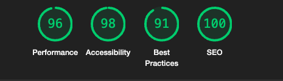     |
| Products            | 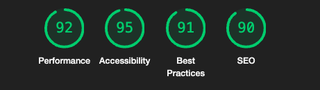   |
| Product Detail      | 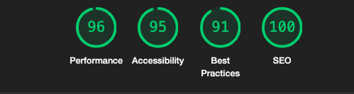   |
| Cart                | 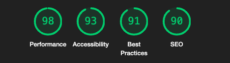     |
| Checkout            | 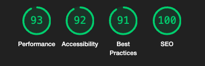 |
| Register            | 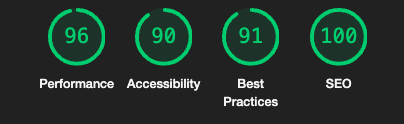          |
| Login               | 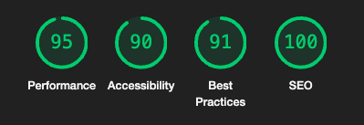    |
| Logout              | 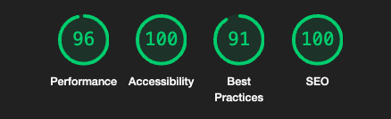   |
| Profile             | 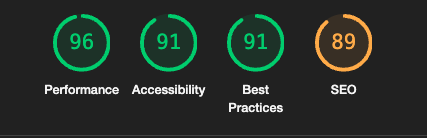  |
| Contact             | 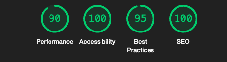  |
| Contact Submissions | 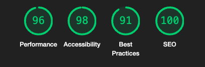          |
| Product Management  | 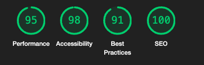          |

# Manual Testing

A range of devices were used to test the site.

* OnePlus 7T Pro (Firefox, chrome, opera)
* MAC: MacBook Pro 14-inch 2021 (Mac OS Ventura 13.6.2) (Chrome, Safari, Firefox)

[Browserstack](https://www.browserstack.com/) was also used to test on the following devices:

* iPhone 15 (Chrome, Safari)
* iPhone 12 mini (Chrome, Safari)

| **Feature**        | **Expected**                                                                                                | **Pass/fail** |
| ------------------ | ----------------------------------------------------------------------------------------------------------- | ------------- |
| Navbar             | All links should redirect to the correct page                                                               | Pass          |
| Navbar             | Logout should only be viewable by logged in users                                                           | Pass          |
| Navbar             | Signup and login should only be seen by users not logged in                                                 | Pass          |
| Navbar             | Contact Form submissions should only be seen by Super Users                                                 | Pass          |
| Navbar             | Product Management should only be seen by Super Users                                                       | Pass          |
| Navbar             | Checkout total should update as products are added to cart                                                  | Pass          |
| Homepage           | The overlay text in the homepage image should reduce for smaller screen sizes                               | Pass          |
| Products           | Products should sort and filter appropriately                                                               | Pass          |
| Product Detail     | The increase and decrease quantity buttons should add the correct amount to the cart                        | Pass          |
| Product Detail     | If the product has ratings, this should be indicated on the product detail and update with each rating      | Pass          |
| Product Detail     | If the product does not have ratings, this should be indicated on the product detail                        | Pass          |
| Product Detail     | User can add products to cart, logged in and logged out                                                     | Pass          |
| Product Review     | If the product has not been reviewed there will be a message encouraging the user to purchase it and review | Pass          |
| Product Review     | The user can only review the product if they have ordered it before                                         | Pass          |
| Product Review     | The user can only review the product one time to prevent skewed ratings                                     | Pass          |
| Product Review     | The user can edit only their review                                                                         | Pass          |
| Product Review     | The user can delete only their review                                                                       | Pass          |
| Authentication     | User can register account                                                                                   | Pass          |
| Authentication     | User can log in                                                                                             | Pass          |
| Authentication     | User can log out                                                                                            | Pass          |
| Authentication     | Users can receive an email confirmation mail before they can log in                                         | Pass          |
| Product Management | Superusers can add products                                                                                 | Pass          |
| Product Management | Logged out users cannot add products                                                                        | Pass          |
| Product Management | Non-admin users cannot add products                                                                         | Pass          |
| Product Management | Superusers can edit products                                                                                | Pass          |
| Product Management | Non-admin users cannot edit products                                                                        | Pass          |
| Product Management | Logged out users cannot edit products                                                                       | Pass          |
| Product Management | Non-admin users cannot delete products                                                                      | Pass          |
| Product Management | Logged out users cannot delete products                                                                     | Pass          |
| Product Management | Superusers can delete products                                                                              | Pass          |
| Toast Messages     | All users get toast messages on their CRUD actions, and disallowed actions                                  | Pass          |
| Contact            | Users can post to the contact form                                                                          | Pass          |
| Contact            | Superusers can view the contact form submissions on the front end                                           | Pass          |
| Contact            | Non-logged in users and non-admin users cannot view the contact form submissions                            | Pass          |
| Cart               | Update and remove buttons on cart quantity form perform the expected action                                 | Pass          |
| Cart               | Grand total and shipping price updates correctly when the threshold is reached                              | Pass          |
| Cart               | Spend X to get free shipping updates appropriately                                                          | Pass          |
| Checkout           | Use can save details from checkout to their profile                                                         | Pass          |
| Checkout           | User can add Stripe test card                                                                               | Pass          |
| Checkout           | Payment is taken in Stripe                                                                                  | Pass          |
| Checkout           | Webhooks are successful in Stripe Dashboard                                                                 | Pass          |
| Checkout           | Loading modal appears when payment is processing                                                            | Pass          |
| Footer             | Footer link opens the Facebook business page in a new tab                                                   | Pass          |
| Newsletter         | User can add their email to the newsletter                                                                  | Pass          |
| Newsletter         | If user email is already on newsletter, Mail Chimp confirms it                                              | Pass          |
| Profile            | User can only edit details in profile                                                                       | Pass          |
| Profile            | User can view their order history in profile                                                                | Pass          |

# Bugs

## Known Bugs

To my knowledge there are no further bugs on this project

## Fixed bugs

All resolved bugs are listed on the [kanban board for the project](https://github.com/users/saziosu/projects/5)